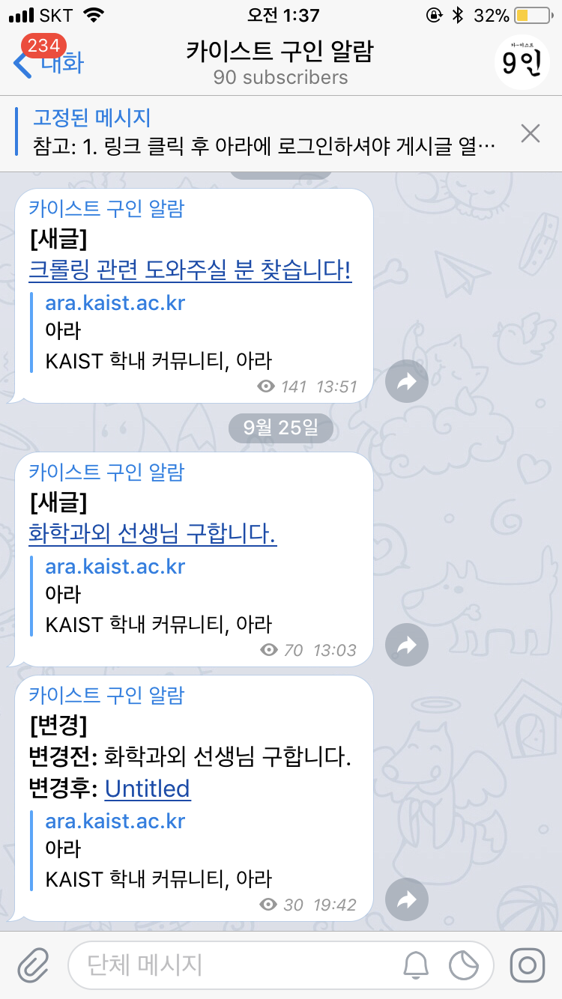

# 9IN
**9IN**은 카이스트 교내 커뮤니티 사이트에 올라오는 새 구인글이나 마감 여부를 모니터링해서 텔레그램 메시지로 보내주는 비영리 서비스입니다.
텅장을 통장으로 바꾸기 위해 애쓰시는 모든 카이스트 학우분들께 바칩니다.  

채널 링크 : https://t.me/kaist9in

# Motivation  
카이스트 교내 커뮤니티 사이트인 아라 Wanted 탭에는 다양한 구인글이 올라온다. 가끔씩 괜찮은 일거리가 올라오지만 아라의 접근성은 낮고 자주 확인하기에도 너무 번거로워서 새 글이 올라오면 모바일 푸쉬 알람이 오면 좋겠다는 생각이 들었다.   

# Screenshots  

 
 

 
  아라 게시판에 새 글 업로드나 글 제목의 변경을 감지해 알려줍니다.   메시지 링크를 통해 게시글을 열 수 있습니다.   

# Tech/Framework Used
- [Python 3.6.5](https://www.python.org/downloads/release/python-365/) (Favorite Language)
- [requests](https://pypi.org/project/requests/) (Fast Posts Pulling)
- [bs4](https://pypi.org/project/beautifulsoup4/) (Parsing HTML Table)
- [selenium](https://pypi.org/project/selenium/) (Posts Content Pulling)
- linux_chromedriver (Mate of Selenium)
- [python-telegram-bot](https://python-telegram-bot.org/) (Telegram Push Notification)
- [ubuntu systemd](https://wiki.ubuntu.com/systemd)  (Automaitc Start & Restart)
- [AWS Lightsail](https://aws.amazon.com/ko/lightsail/) (Low Cost Minimal Server)

# TODO
- [X] Fix delete post error
- [X] Filtering carfull articles
- [X] Add telegram push notification
- [ ] Add content preview
- [ ] Add personal searching, filtering keyword on telegram bot
- [ ] Add portal monitoring 
- [ ] Execute the push message function as subprocess
