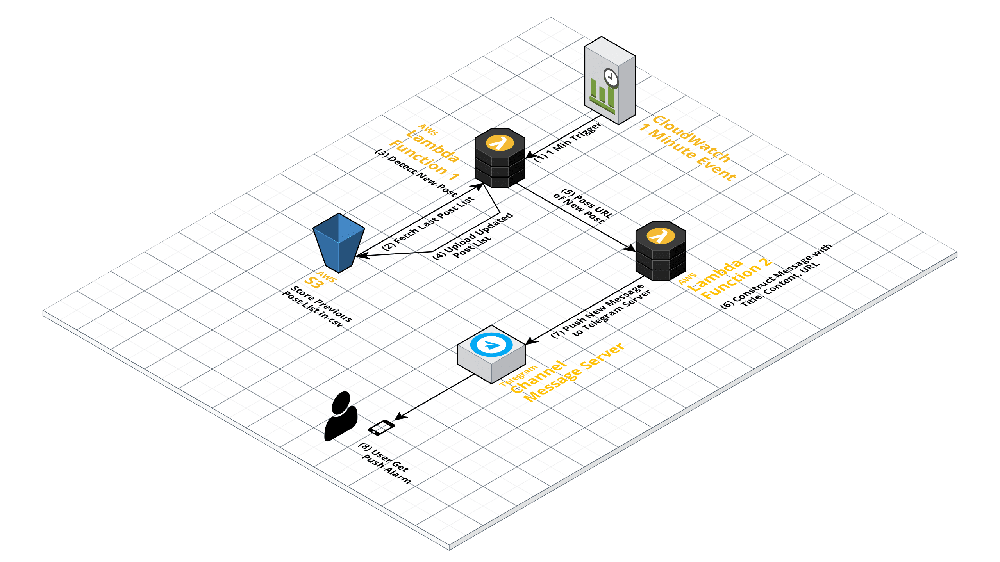

 

# 9IN
**9IN**은 카이스트 교내 커뮤니티 사이트에 올라오는 구인 게시글들을 모니터링해서 텔레그램 메시지로 보내주는 비영리 서비스입니다. 텅장을 통장으로 바꾸기 위해 애쓰시는 모든 카이스트 학우분들께 바칩니다.  

채널 링크 : https://t.me/kaist9in 

# Motivation  
평소 카이스트 교내 커뮤니티 사이트인 아라 Wanted 탭에는 다양한 구인글이 하루에도 5~10개 가량 올라옵니다. 간혹 꿀알바 정도에 해당하는 괜찮은 일거리가 올라오지만 아라 페이지라는 것이 하루에 수시로 들어가게 되는 사이트는 아니여서 새 글 업로드를 알려주는 모바일 푸쉬 알람을 생각하게 됐습니다.    

# Screenshots  

 
 

 
  아라 구인란에 새 글 업로드를 감지해 텔레그램 메신저로 알려줍니다.   자세히 보기를 통해 원문 페이지로 접속할 수 있습니다.   

  

# System Architecture  

 

 
  AWS Cloud Architecture   

  

**[서비스 구성]**  
1. AWS CloudWatch가 1분마다 첫번째 Lambda 함수(handler_monitor_post.py)를 실행시킵니다.  
2. Lambda 함수가 실행되면서 S3 버킷으로부터 마지막으로 체크했던 게시글들의 리스트를 다운로드합니다.
3. 아라 사이트에 접속하여 현재 게시글들의 리스트를 가져오고 이전 게시글과 비교하여 신규 업로드 글을 감지합니다. 이때 카풀이나 거래 관련 글은 키워드를 바탕으로 제외시킵니다.   
4. 현재 게시글 리스트로 S3 파일을 업데이트합니다.  
5. 새로운 글들의 URL을 인자로 삼아 두번째 Lambda 함수(handler_post_content)를 실행시킵니다.  
6. Selenium과 Chromium을 이용해 아라 사이트에 로그인 후 게시글 들의 본문 내용을 가져옵니다. 게시글 제목, 본문 내용, URL을 취합해 메시지를 생성합니다.  
7. 생성된 메시지를 Telegram 봇에게 보내줍니다.  
8. 봇이 구인 알람 채널에 새 게시글을 게재해 유저로 하여금 푸쉬 알람을 받게 합니다.    

# Tech/Framework Used
- [Python 3.6.5](https://www.python.org/downloads/release/python-365/) (Favorite Language)
- [requests](https://pypi.org/project/requests/) (Fast Post List Pulling)
- [bs4](https://pypi.org/project/beautifulsoup4/) (Parsing HTML Table)
- [selenium](https://pypi.org/project/selenium/) (Posts Body Content Pulling)
- linux_chromedriver (Mate of Selenium)
- [python-telegram-bot](https://python-telegram-bot.org/) (Telegram Push Notification)

# TODO  
### Feature  
- [X] Fix delete post error
- [X] Filtering carfull articles
- [X] Add telegram push notification
- [X] Add article preview feature  
- [ ] Monitor not only 'Wanted' Tab but also 'Job' Tab  
- [ ] Add intent url to open the link with default browser(iOS/Android)    

### Deploy  
- [ ] Move source code into scr folder
- [ ] Deploy script change configuration between test/deploy  

### Security  
- [ ] Separate and store api keys and tokens in safe place

# Reference  
- 